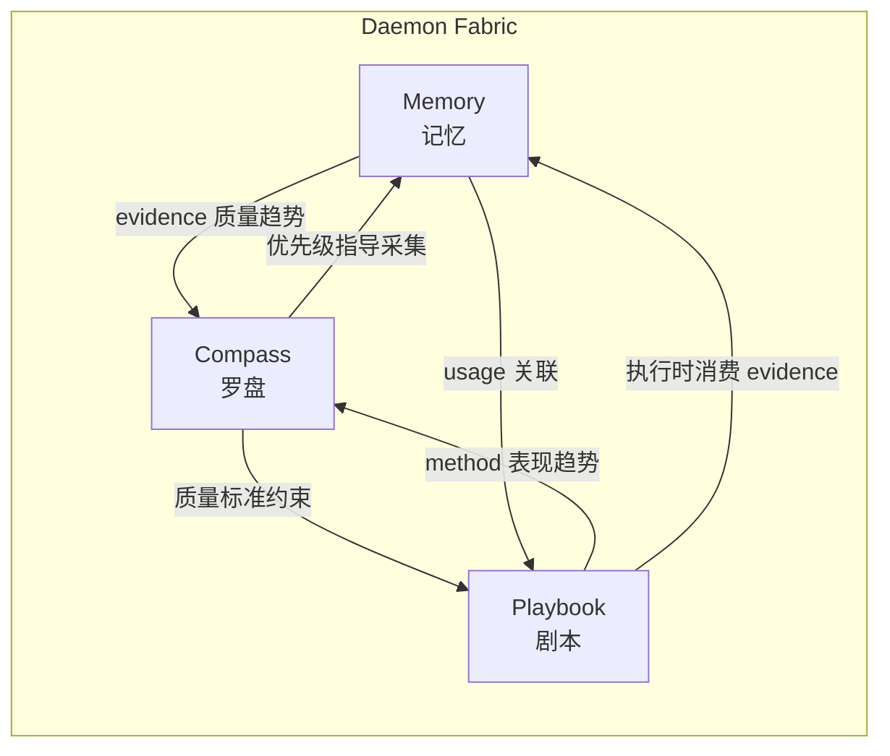
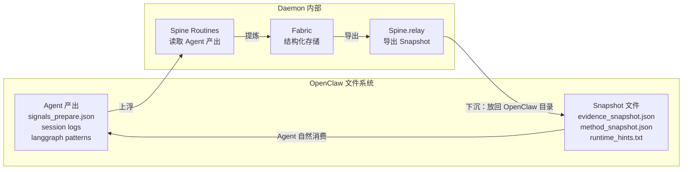
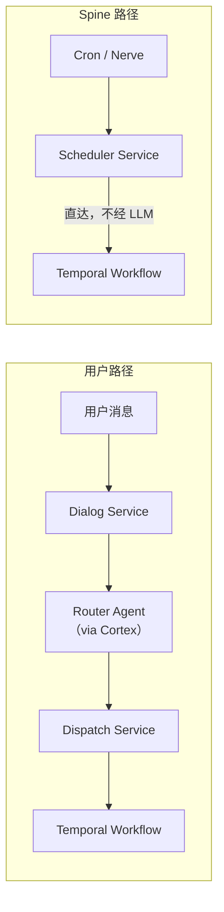

# Daemon — 新一代多智能体系统设计方案

> 历史基线声明（2026-03-04）  
> 本文档定义 Daemon 的基础骨架（Fabric/Spine/Cortex/边界与基础接口），作为历史基线保留。  
> 后续新增与演进能力请以 `.ref/daemon_统一方案_v2.md` 为唯一执行权威。  
> 若口径冲突，以 `daemon_统一方案_v2.md` 为准。

> Daemon：后台守护进程，持续运行、自主治理、默默进化。

---

## 一、指导思想

### 1. LLM 是能力，不是系统

系统的可靠性不依赖 LLM 的可靠性。LLM 提供智能（理解、生成、判断），系统本身提供结构、治理和保障。LLM 不可用时系统降级运行，而不是停止运行。

### 2. 知识闭环

每个任务都产生知识，每个知识都改进未来的任务。没有 fire-and-forget。反馈是一等公民，不是附带操作。

### 3. 确定性治理，智能感知

Spine 做确定性决策（阈值、规则、边界），但可以调用 LLM 作为感知工具。决策可审计、可预测；感知尽力而为、可降级。

### 4. 单一事实来源

每种信息只有一个权威存储。不允许并行存储同类数据。

### 5. 显式优于隐式

依赖关系必须声明，触发条件必须声明，策略和阈值必须在配置中。

### 6. 可降级

每个组件都有降级模式。Gate 分级（GREEN/YELLOW/RED）。混合 Spine Routine 在 LLM 不可用时降级到纯确定性模式。

### 7. 可观测

每个操作产生结构化 trace。系统可以随时回答"做了什么、为什么、结果如何"。

### 8. 管理者不碰代码

所有策略、阈值、调度、优先级、Agent 配置都通过管理端 Console 修改，不需要编辑源代码或配置文件。代码只定义逻辑，不定义数据。

### 9. 透明内化

Daemon 的核心设计哲学：**在每一个与外部系统的接触面上，做一层透明的认知包裹。** 外部系统（OpenClaw、Temporal、LLM Provider、数据源、用户）按自己的方式正常工作，不需要任何改造。Daemon 静默读取它们的行为数据，提炼为结构化知识写入 Fabric，再以外部系统自然接受的格式（文件/参数/配置）回注优化决策。外部系统甚至不知道自己被观察和优化了。

统一模式：

```
外部系统正常工作（不做任何修改）
    ↓ Spine.witness 静默读取行为数据
提炼为结构化知识写入 Fabric
    ↓ Spine.relay / Spine.focus 输出优化决策
以外部系统自然接受的格式回注
    ↓ 外部系统下次运行时行为自动改进
```

---

## 二、核心命名体系


| 概念      | 名称           | 隐喻                            |
| ------- | ------------ | ----------------------------- |
| 系统整体    | **Daemon**   | 后台守护进程，持续运行的自治实体              |
| 事实知识存储  | **Memory**   | Daemon 的记忆——关于世界的事实           |
| 程序知识存储  | **Playbook** | Daemon 的剧本——执行任务的方法           |
| 元认知知识存储 | **Compass**  | Daemon 的罗盘——关注什么、优先什么         |
| 三者统称    | **Fabric**   | 三层 Fabric 编织成 Daemon 的认知基底    |
| 治理协议    | **Spine**    | Daemon 的脊柱——自治行为的确定性骨架        |
| 治理操作单元  | **Routine**  | Spine 的九个例行操作（取代旧称 "Family"）  |
| 内部事件系统  | **Nerve**    | Daemon 的神经——组件间的信号传递          |
| LLM 抽象层 | **Cortex**   | Daemon 的皮层——思考和感知的能力来源        |
| 用户界面    | **Portal**   | 用户入口——消费 Daemon 的产出           |
| 管理界面    | **Console**  | 操作台——观测和控制 Daemon 的行为         |
| 设计哲学    | **透明内化**     | Daemon 对外部系统的认知包裹——静默观察、提炼、回注 |


---

## 三、三层 Fabric

### 3.1 Memory — "Daemon 知道什么"

存储事实性知识：信号、事件、知识单元。Daemon 对外部世界和自身运行态的结构化记忆。

**核心能力：**

- **Intake**：批量写入原始事件
- **Distill**：去重、合并、标准化（Cortex 辅助语义去重）
- **Query**：按 domain/tier/时间/关键词检索
- **Expire**：按 tier 策略自动过期
- **Usage Tracking**：记录哪些 evidence 被哪些任务使用、效果如何
- **Link**：建立知识单元间的语义关联（支持/矛盾/延伸）
- **Snapshot**：导出只读快照供 Agent 消费

**数据模型（SQLite）：**

- `units`：核心知识单元（unit_id, title, domain, tier, confidence, summary_zh, summary_en, status, created/updated/expires_utc）
- `sources`：来源追溯（source_id, unit_id, provider, url, tier, raw_hash）
- `audit`：操作审计（action, actor, timestamp, detail）
- `usage`：使用记录（unit_id, task_id, playbook_id, outcome, used_utc）
- `links`：语义关联（from_id, to_id, relation, confidence, created_utc）

**实现说明：** 全新实现。旧系统 `src/fabric/evidence.py` 的 schema 设计可参考，但 ingest/canonicalize 逻辑是半成品，需重新设计（特别是加入 Cortex 辅助的语义去重和 link 发现）。

---

### 3.2 Playbook — "Daemon 怎么做事"

存储程序性知识：DAG 执行模式、任务策略、性能评估。Daemon 从经验中学到的"最佳打法"。

**核心能力：**

- **Register**：注册新的 method 候选（从 Spine.learn 自动发现或通过 Console 手动定义）
- **Evaluate**：记录每次执行的成功/失败/评分
- **Promote / Retire**：基于统计阈值自动晋升活跃 / 退役低效方法
- **Consult**：规划时查询"这类任务用什么 DAG 最好"，返回推荐方法和历史成功率
- **Version**：每个 method 保留完整版本历史
- **Stats**：聚合统计——按 task_type/category 的成功率、趋势、最佳方法

**数据模型（SQLite）：**

- `methods`：方法定义（method_id, name, category, description, spec_json, status, version, success_rate, total_runs, created/promoted/retired_utc）
- `versions`：版本历史（version_id, method_id, version, spec_json, created_utc, change_reason）
- `evaluations`：评估记录（eval_id, method_id, task_id, outcome, score, detail_json, evaluated_utc）

**实现说明：** 全新实现。旧系统 `src/fabric/method.py` 的 auto_promote_check 阈值逻辑（promote >= 70% success, retire <= 35%）可参考。但 register/evaluate 在旧系统中基本没被实际调用过，需要从 Spine.learn 和 Spine.judge 的视角重新设计调用链。

---

### 3.3 Compass — "Daemon 关注什么"

存储元认知知识：优先级、偏好、资源策略。Daemon 的"方向感"——决定关注什么领域、投入多少资源、以什么标准衡量质量。

**为什么需要：** 旧系统中"关注什么"散落在 27 个 config JSON 文件中，互不关联，无法被系统学习和调整。Compass 将其统一为一个可查询、可演化、可通过 Console 管理的结构。

**核心能力：**

- **Domain Priorities**：哪些领域当前最重要（影响 intake 的采集深度和 distill 的质量标准）
- **Quality Profiles**：不同任务类型的质量要求（影响质量门禁的阈值）
- **Resource Budgets**：token 预算、并发限制、时间窗口（影响编排层的资源分配）
- **Preferences**：用户输出偏好（语言、格式、频率、渠道）
- **Attention Signals**：来自 Spine.witness 的趋势信号（"某领域近期事件密集，建议提升优先级"）
- **Version History**：所有配置变更可追溯、可回滚

**数据模型（SQLite）：**

- `priorities`：领域优先级（domain, weight, reason, updated_utc, source）
- `quality_profiles`：质量配置（task_type, rules_json, updated_utc）
- `resource_budgets`：资源预算（resource_type, daily_limit, current_usage, reset_utc）
- `preferences`：用户偏好（key, value, updated_utc, source）
- `attention_signals`：注意力信号（signal_id, domain, trend, severity, observed_utc, expires_utc）
- `config_versions`：配置版本历史（config_key, version, value_json, changed_utc, changed_by, reason）

**实现说明：** 全新设计和实现。旧系统 27 个 config JSON 文件的现有值可作为 Compass 的初始数据种子导入。

---

### 三个 Fabric 的交互关系




- Memory 告诉 Playbook"有哪些素材可用"
- Playbook 告诉 Memory"哪些素材被用了、效果如何"
- Compass 告诉 Memory"哪些领域需要更多采集"
- Compass 告诉 Playbook"什么质量标准才算合格"
- Memory 和 Playbook 的运行数据反馈给 Compass 做趋势调整

---

## 四、Spine 治理协议

Spine 是 Daemon 的脊柱：一组自治运行的 **Routine**（例行操作），负责系统的感知、学习、治理和维护。

### 4.1 十个 Routine


| Routine     | 认知模式       | 职责                                                                     | 触发方式                                     |
| ----------- | ---------- | ---------------------------------------------------------------------- | ---------------------------------------- |
| **pulse**   | 纯确定性       | 探测基础设施健康（API / Gateway / Temporal），写 Gate 状态（GREEN/YELLOW/RED）         | cron(*/10) + nerve(service_error)        |
| **intake**  | 纯确定性       | 将 collect agent 产出的外部信号写入 Memory                                       | cron + nerve(collect_completed)          |
| **record**  | 纯确定性       | 任务完成时即时记录：写 Playbook evaluation、Memory usage、trace 摘要。学习链条的起点，零 LLM 成本 | nerve(task_completed)                    |
| **witness** | 混合(Cortex) | 批量分析最近一批 record 产出的数据，提取结构化观察和 attention_signals                       | cron(自适应 2-12h)                          |
| **distill** | 混合(Cortex) | Memory 语义去重、合并、冲突解决、link 发现                                            | cron + nerve(intake_completed)           |
| **learn**   | 混合(Cortex) | 批量分析最近 evaluation，提取 DAG 模式和教训，注册 Playbook 候选，生成 Skill Evolution 提议    | cron(自适应 2-12h, witness 后 30min)         |
| **judge**   | 纯确定性       | 基于统计阈值晋升/退役 Playbook 中的方法                                              | cron(daily)                              |
| **focus**   | 混合(Cortex) | 分析 witness 产出的 attention_signals，调整 Compass 中的领域优先级和资源分配               | cron(weekly) + nerve(attention_critical) |
| **relay**   | 纯确定性       | 刷新三个 Fabric 的 snapshot + skill_index.json，供 Agent 和 API 消费             | cron + nerve(fabric_updated)             |
| **tend**    | 纯确定性       | 过期清理、Gate 恢复后 replay、Fabric 压缩、state 整理、孤立 session 清理                  | cron(daily) + nerve(gate_changed)        |


#### 自适应学习节奏

witness 和 learn 的执行频率不固定，由 Compass 中的 `learning_rhythm` 配置控制：

- Spine.record 在每次写入后统计"最近一个周期内累积的未分析 evaluation 数量"
- 未分析 evaluation < 3 条 → 推迟本轮 witness/learn（数据不够，分析无意义）
- 未分析 evaluation > 20 条 → 缩短下次间隔至最小 2h（数据充足，及时学习）
- 默认间隔 4h，范围 2h-12h
- 任务密集时学习更频繁，任务稀疏时更节省 Cortex 成本
- 这本身就是"透明内化"原则的应用：系统观察自己的任务量，动态调整学习节奏

### 4.2 Spine Registry

```json
{
  "version": 3,
  "routines": {
    "spine.pulse": {
      "mode": "deterministic",
      "schedule": "*/10 * * * *",
      "nerve_triggers": ["service_error"],
      "reads": ["infra:health"],
      "writes": ["state:gate"],
      "depends_on": [],
      "degraded_mode": null
    },
    "spine.intake": {
      "mode": "deterministic",
      "schedule": "0 4 * * *",
      "nerve_triggers": ["collect_completed"],
      "reads": ["runs:collect_output"],
      "writes": ["fabric:memory:units"],
      "depends_on": [],
      "degraded_mode": null
    },
    "spine.record": {
      "mode": "deterministic",
      "schedule": null,
      "nerve_triggers": ["task_completed", "delivery_completed"],
      "reads": ["state:traces"],
      "writes": ["fabric:playbook:evaluations", "fabric:memory:usage", "state:traces:summary"],
      "depends_on": [],
      "degraded_mode": null
    },
    "spine.witness": {
      "mode": "hybrid",
      "schedule": "adaptive:4h:2h-12h",
      "nerve_triggers": [],
      "reads": ["state:tasks", "state:traces", "fabric:memory:stats", "fabric:playbook:stats", "fabric:playbook:evaluations:unanalyzed"],
      "writes": ["fabric:memory:observations", "fabric:compass:attention_signals"],
      "depends_on": ["spine.record"],
      "degraded_mode": "stats_only"
    },
    "spine.distill": {
      "mode": "hybrid",
      "schedule": "30 4 * * *",
      "nerve_triggers": ["intake_completed"],
      "reads": ["fabric:memory:units"],
      "writes": ["fabric:memory:units", "fabric:memory:links"],
      "depends_on": ["spine.intake"],
      "degraded_mode": "string_match_only"
    },
    "spine.learn": {
      "mode": "hybrid",
      "schedule": "adaptive:4h30m:2h30m-12h30m",
      "nerve_triggers": [],
      "reads": ["state:tasks", "state:traces", "fabric:playbook:active", "fabric:memory:observations"],
      "writes": ["fabric:playbook:candidates", "state:skill_evolution_proposals"],
      "depends_on": ["spine.witness"],
      "degraded_mode": "skip"
    },
    "spine.judge": {
      "mode": "deterministic",
      "schedule": "0 5 * * *",
      "nerve_triggers": [],
      "reads": ["fabric:playbook:evaluations"],
      "writes": ["fabric:playbook:methods"],
      "depends_on": ["spine.learn"],
      "degraded_mode": null
    },
    "spine.focus": {
      "mode": "hybrid",
      "schedule": "0 6 * * 1",
      "nerve_triggers": ["attention_critical"],
      "reads": ["fabric:compass:attention_signals", "fabric:memory:stats", "fabric:playbook:stats"],
      "writes": ["fabric:compass:priorities", "fabric:compass:resource_budgets"],
      "depends_on": ["spine.witness"],
      "degraded_mode": "no_adjustment"
    },
    "spine.relay": {
      "mode": "deterministic",
      "schedule": "0 */4 * * *",
      "nerve_triggers": ["fabric_updated"],
      "reads": ["fabric:memory", "fabric:playbook", "fabric:compass"],
      "writes": ["state:snapshots", "openclaw:skill_index"],
      "depends_on": [],
      "degraded_mode": null
    },
    "spine.tend": {
      "mode": "deterministic",
      "schedule": "0 3 * * *",
      "nerve_triggers": ["gate_changed"],
      "reads": ["state", "fabric:memory", "fabric:playbook", "openclaw:sessions"],
      "writes": ["state", "fabric:memory:gc", "fabric:playbook:gc", "openclaw:sessions:gc"],
      "depends_on": [],
      "degraded_mode": null
    }
  }
}
```

### 4.3 混合模式的降级规则

每个混合 Routine 声明 `degraded_mode`：

- **witness**: `stats_only` — 只输出数字统计（成功率、计数），不做趋势解读
- **distill**: `string_match_only` — 回退到 URL/标题字符串匹配，跳过语义相似度和 link 发现
- **learn**: `skip` — 跳过本轮（record 已确保原始数据不丢失，下次 Cortex 恢复后再批量分析）
- **focus**: `no_adjustment` — 不调整优先级，维持现有 Compass 配置

降级触发：Cortex API 调用失败时自动降级，trace 中记录 `"degraded": true`。Cortex 恢复后自动回到完整模式。

### 4.4 三级 Gate

```json
{
  "status": "GREEN | YELLOW | RED",
  "level_policy": {
    "GREEN": "所有任务正常执行",
    "YELLOW": "仅执行 Spine routine + 高优先级用户任务，低优先级排队",
    "RED": "仅执行 spine.pulse + spine.tend，其余全部暂停"
  },
  "degraded_services": [],
  "updated_utc": "...",
  "reasons": []
}
```

---

## 五、Nerve — 内部事件系统

Nerve 是 Daemon 的神经网络：组件间的异步信号通道。

**核心事件：**


| 事件                   | 触发时机                                  | 消费者                 |
| -------------------- | ------------------------------------- | ------------------- |
| `service_error`      | 任何运行时组件健康检查失败                         | spine.pulse         |
| `collect_completed`  | collect agent 完成数据采集                  | spine.intake        |
| `intake_completed`   | spine.intake 写完 Memory                | spine.distill       |
| `task_completed`     | Temporal 工作流结束（成功或失败）                 | spine.record        |
| `delivery_completed` | Delivery Service 完成交付（产出物归档 + 渠道推送）   | spine.record        |
| `fabric_updated`     | 任何 Fabric 发生写入                        | spine.relay         |
| `attention_critical` | spine.witness 写入高严重度 attention_signal | spine.focus         |
| `gate_changed`       | Gate 状态变化                             | spine.tend (replay) |


**设计：**

```python
class Nerve:
    """进程内轻量事件总线。同步派发，带 trace 记录。"""
    def emit(self, event: str, payload: dict) -> None: ...
    def on(self, event: str, handler: Callable) -> None: ...
    def recent(self, limit: int = 50) -> list[dict]: ...  # Console 用
```

---

## 六、Cortex — LLM 抽象层

Cortex 是 Daemon 的思考能力来源，为 Spine 混合 Routine 和 Agent 提供统一的 LLM 访问。

```python
class Cortex:
    """统一 LLM 访问层。管理 provider 选择、fallback、token 计量、降级判定。"""

    def embed(self, texts: list[str]) -> list[list[float]]: ...
    def complete(self, prompt: str, model: str | None = None, ...) -> str: ...
    def is_available(self) -> bool: ...
    def try_or_degrade(self, fn: Callable, fallback: Callable) -> Any: ...
    def usage_today(self) -> dict: ...  # token 用量统计

    # Spine Routine 专用：结构化 LLM 调用，返回 JSON
    def structured(self, prompt: str, schema: dict, ...) -> dict: ...
```

**设计要点：**

- Provider 优先级和 fallback 策略从 Compass 读取
- Token 用量写入 Compass 的 resource_budgets
- 所有调用记录 trace（prompt 摘要 + token 数 + 耗时），供 Console 的 Trace Viewer 查看
- `try_or_degrade` 是 Spine 混合 Routine 的核心方法：先尝试 LLM 调用，失败则执行降级 fallback

---

## 七、OpenClaw 与 Temporal 的定位

### 7.1 核心原则：Agent 相关的归 OpenClaw，Agent 不参与的归 Daemon

OpenClaw 和 Temporal 不是 Daemon 的从属模块——它们是**独立运行时**，Daemon 与它们协作。

**OpenClaw 拥有且继续管理的（凡 Agent 参与的）：**

- Agent Workspaces（AGENTS.md / SOUL.md / skills / memory）
- Agent Sessions（对话日志、状态管理）
- Skills 系统（29 个 SKILL.md，OpenClaw 格式）
- Cron 调度器（应用级定时任务——日简报、周报等，因为这些需要 Router 做规划）
- Telegram 集成（Agent 与用户的消息通道）
- Agent Memory（per-agent 工作记忆、对话历史）
- Gateway 进程（Agent 生命周期管理）
- Credential 管理

**Daemon 在 OpenClaw 之上添加的（Agent 不参与、用户不可见的）：**

- **Fabric**（Memory / Playbook / Compass）— OpenClaw 没有结构化知识存储
- **Spine**（9 Routines + Nerve）— OpenClaw 没有确定性治理协议
- **Cortex**（统一 LLM 抽象）— Spine 混合 Routine 需要独立的 LLM 调用能力
- **Console**（管理界面）— OpenClaw 没有可视化管理工具
- **Scheduler**（Spine Routine 直达触发）— 不经过 Router/LLM

**调度分工：**

- OpenClaw Cron → 应用级任务（需要 Router 规划的：日简报、周报等）
- Daemon Scheduler → Spine Routine 触发（直达 Temporal，不经过 LLM）

### 7.2 Fabric 与 OpenClaw Memory 的关系

Fabric 是 OpenClaw Agent Memory 的**更深一级抽象**：

- **Agent Memory**（OpenClaw 管理）：per-agent 工作记忆，非结构化，临时性。如 router 的 `langgraph_patterns/`、collect 的信号缓存、各 agent 的 SQLite 对话历史。
- **Fabric**（Daemon 管理）：系统级结构化知识存储，跨 agent、持久化、有审计、有关联、可查询。

Agent 感知不到 Fabric 的存在。数据流向：




### 7.3 Daemon 对 OpenClaw 各文件系统的具体桥接


| OpenClaw 文件                                          | Daemon 的姿态   | 内化方式                                                               |
| ---------------------------------------------------- | ------------ | ------------------------------------------------------------------ |
| `agents/*/sessions/*.jsonl`（会话日志）                    | 只读           | Spine.witness 读取 → 提炼到 Memory（任务成功率、Agent 表现、错误模式）                 |
| `workspace/router/memory/langgraph_patterns/`（学习模式）  | 读 + 回写       | Spine.learn 读取 → 提炼到 Playbook → Spine.relay 写回 `runtime_hints.txt` |
| `runs/*/steps/*/internal/signals_prepare.json`（采集信号） | 只读           | Spine.intake 读取 → 提炼到 Memory                                       |
| `memory/*.sqlite`（Agent 对话记忆）                        | 只读观察         | Spine.witness 统计分析（token 用量趋势、对话轮次、异常）                             |
| `workspace/*/skills/*/SKILL.md`（Skills）              | Console 直接读写 | 不做抽象，SKILL.md 文件即接口                                                |
| `cron/jobs.json`（定时任务）                               | Console 直接读写 | Spine Routine 调度走 Daemon 自己的 Scheduler                             |
| Fabric Snapshots（由 Daemon 生成）                        | 由 Daemon 写入  | Spine.relay 生成 → 放入 OpenClaw 目录 → Agent 自然消费                       |


---

## 八、透明内化设计

"透明内化"是 Daemon 的核心设计哲学，贯穿所有与外部系统的接触面。以下是五个具体的内化目标。

### 8.1 内化 Temporal 的执行经验

**现状**：Temporal 只是"提交 DAG 就执行"的黑箱。重试次数（3）、超时时间（480s）全部硬编码。

**内化方式**：

- Spine.witness 读取 Temporal 的工作流执行历史 → 提取模式：
  - "collect 步骤平均耗时 120s，但 arXiv 相关的 collect 平均 280s"
  - "凌晨 3-4 点的工作流失败率是其他时段的 3 倍"
- 模式写入 **Playbook**（"arXiv collect 步骤应该给 400s 超时"）和 **Compass**（"避免在凌晨 3-4 点调度重要任务"）
- Dispatch 提交工作流时从 Playbook 读取最优 retry/timeout 参数

**效果**：Temporal 感知不到任何变化。但 Daemon 根据历史为每个步骤定制了最优执行参数。

### 8.2 内化 LLM Provider 的行为特征

**现状**：模型选择是静态的（`model_profiles.json` 写死 provider 配置）。

**内化方式**：

- Cortex 记录每次 LLM 调用的结构化 trace（model、prompt 长度、延迟、token 成本、成功/失败）
- Spine.witness 分析 → 发现模式：
  - "DeepSeek 在结构化输出上成功率 95%，长文本生成只有 60%"
  - "MiniMax 高峰时段延迟翻倍"
- 模式写入 **Compass** 的 model_routing 维度
- Cortex 下次选择模型时从 Compass 读取动态路由策略

**效果**：实现**自适应模型路由**——系统自动学会"什么模型最适合什么任务"。

### 8.3 内化外部数据源的可靠性

**现状**：collect agent 对所有数据源（RSS / HN / arXiv / GitHub）同等对待。

**内化方式**：

- Memory Fabric 的 `usage` 表追踪每条 evidence 被哪个任务使用、任务是否成功
- Spine.witness 聚合 → "arXiv evidence 使用率是 RSS 的 3 倍"、"GitHub trending 信号从不被引用"
- 分析写入 **Compass** 的 domain priorities（source-level 权重）
- Spine.relay 导出 snapshot → collect agent 读到"AI 领域优先 arXiv，降低 RSS 权重"

**效果**：数据源不知道自己被评估。采集质量随时间自然提升。

### 8.4 内化用户的行为模式

**现状**：用户偏好手动配置（语言、频率、渠道）。

**内化方式**：

- Spine.witness 分析 Telegram 消息历史和 Portal 访问日志 → 提取模式：
  - "用户每周一早上 9 点必看 AI 简报，但周报经常被忽略"
  - "用户最近两周密集询问安全相关话题"
- 模式写入 **Compass** 的 preferences 和 attention_signals
- 日简报的领域覆盖、推送时间自动调整

**效果**：用户感知到"系统越来越懂我了"，无需手动配置。

### 8.5 内化自身的运行规律

**Daemon 观察 Daemon 自己**——最深的一层自反馈。

- Spine Routines 自身产生 trace
- Spine.witness 分析 **Spine 自己的 trace** →
  - "distill 耗时翻倍，Memory 中孤立条目太多"→ Compass 调整 tend 频率
  - "learn 降级率 40%，Cortex 近期不稳定"→ Compass 调整 Cortex fallback 策略
  - "focus 上次调整的优先级没有带来采集质量提升"→ 回滚优先级调整
- 系统在优化自己的治理协议

---

## 九、七层架构与模块划分

### 第 1 层：基础设施（选型，不写代码）

- **SQLite**：嵌入式结构化存储（3 个 Fabric 各一个 DB）
- **文件系统**：运行态（state/）、运行记录（runs/）、快照（snapshots/）
- **LLM API**：OpenAI / Anthropic / DeepSeek / MiniMax，通过 Cortex 抽象
- **Telegram Bot API**：通过适配器访问
- **外部数据源**：RSS / HN / GitHub / arXiv，通过 collect agent 访问

### 第 2 层：数据层（Fabric）

```
daemon/fabric/
  memory.py          # Memory Fabric API
  playbook.py        # Playbook Fabric API
  compass.py         # Compass Fabric API
  __init__.py
```

**设计要点：**

- 三个 Fabric 各自独立 SQLite DB
- 统一 snapshot 导出（JSON）
- 统一 CRUD + Query + Stats API
- 审计日志内建
- 全部从零实现
- 对 OpenClaw Agent Memory 做"更深一级抽象"——Agent 产出的非结构化工作记忆，经 Spine 提炼后成为结构化 Fabric 知识

### 第 3 层：运行时

```
daemon/runtime/
  temporal.py        # Temporal 客户端封装
  openclaw.py        # OpenClaw Gateway 适配器（双向桥接）
  cortex.py          # Cortex (LLM 抽象层，含自适应路由)
  __init__.py
```

**设计要点：**

- Temporal / OpenClaw 是**独立运行时**，Daemon 持有轻量客户端进行协作
- `openclaw.py` 实现双向桥接：读取 Agent 文件产出 → 写回 Snapshot/Hints
- Cortex 统一管理 provider 选择、fallback、token 计量，支持从 Compass 读取动态路由策略
- 所有运行时组件暴露 `health_check()` 方法，供 spine.pulse 探测

### 第 4 层：协议层（Spine + Nerve）

```
daemon/spine/
  registry.py        # Routine 注册表
  routines.py        # 9 个 Routine 的实现
  contracts.py       # IO 合约校验
  nerve.py           # Nerve (内部事件系统)
  trace.py           # 结构化追踪
  __init__.py
```

**设计要点：**

- 每个 Routine 声明认知模式（deterministic / hybrid）
- 混合 Routine 通过 `Cortex.try_or_degrade()` 调用 LLM
- Nerve 事件同步派发，带 trace
- Contracts 检查前置条件（输入存在且新鲜）、后置条件（输出已产生）、写授权
- 透明内化的执行者：witness 负责观察，relay/focus 负责回注

### 第 5 层：能力层（OpenClaw 管辖）

Agent 和 Skills **完全属于 OpenClaw**，Daemon 不拥有它们、不修改它们的文件，只通过适配器协作。

**七个 Agent 角色（OpenClaw 定义和管理）：**

- **router**：意图识别与规划
- **collect**：多源数据采集
- **analyze**：结构化分析
- **build**：工程构建
- **review**：质量审查
- **render**：格式化输出
- **apply**：执行应用

**Daemon 的协作方式：**

- 通过 `runtime/openclaw.py` 适配器与 Gateway 通信
- 通过 Spine.relay 将 Fabric Snapshot 放入 OpenClaw 目录，Agent 自然消费
- 通过 Console 的 Agent Manager 读写 OpenClaw 的 SKILL.md 和 cron/jobs.json
- DAG 模板从 Playbook 动态读取，通过 Dispatch 注入到工作流中
- Agent 角色定义不变，但执行参数（超时、重试）可由 Daemon 根据 Playbook 动态优化

#### Skills 分发策略

**旧系统问题**：29 个 Skill 全部放在 `workspace/router/skills/` 下，其他 Agent 执行时看不到自己的 Skill（OpenClaw 只加载 `workspace/{agent}/skills/` 下的文件）。

**Daemon 策略：按 Agent 归属分发**

```
openclaw/workspace/
  router/skills/               # router 专属（规划、调度类）
    router_intake/
    router_langgraph_plan/
    router_langgraph_revise/
    router_dispatch/
    router_execute_confirm/
    router_chat_only/
    router_runtime_control/
    graph_template_selector/
    graph_shard_planner/
    graph_shard_merge/
    knowledge_pipeline/
  collect/skills/              # collect 专属（采集、去重类）
    collect_dedup_normalize/
    collect_multisource_signals/
  analyze/skills/              # analyze 专属（分析类）
    analyze_structured_reasoning/
  review/skills/               # review 专属（审查类）
    review_mentor_rubric/
    review_rework_decider/
    quality_gate_hard/
  render/skills/               # render 专属（输出类）
    render_formal_writer/
    render_bilingual_split/
  apply/skills/                # apply 专属（发布类）
    publish_outcome_contract/
    publish_overwrite_policy/
    publish_notify_telegram/
  (跨 Agent 系统级 Skill 放在 Daemon config 中，不经 OpenClaw)
    anti_leak_sanitizer         → 纳入 Delivery 质量门
    usage_budget_guard          → 纳入 Cortex token 管理
    gate_health_probe           → 纳入 Spine.pulse
    config_scope_guard          → 纳入 Console Policy Editor
    config_global_defaults      → 纳入 Compass
    archive_retention_sync      → 纳入 Spine.tend
    cron_replay_latest_only     → 纳入 Scheduler replay 逻辑
```

**router 需要 Skill 全局索引**：router 做规划时需要知道所有 Agent 有哪些能力。Spine.relay 生成 `skill_index.json`（名称 + description 摘要），放入 router workspace。router 读索引来规划，不需要加载所有 Skill 全文。

#### 三层学习体系

产出质量的持续提升依赖三个层级的学习机制，各有不可替代的作用：

**第一层：Playbook — 工作流学习（系统自动）**

学习"怎么编排 Agent"——DAG 模式、执行参数、模型选择。

- Spine.learn 从执行历史提取模式，注册 Playbook 候选
- Spine.judge 基于统计阈值晋升/退役方法
- 完全自动，不需要人工干预

**第二层：Skill Evolution — 技能进化（半自动，需审批）**

学习"单个 Agent 怎么做得更好"——改进 Skill 的 contract、procedure、failure 定义。

- Spine.witness 追踪 per-skill 产出质量（review 通过率、返工率、特定失败模式频率）
- Spine.learn 发现改进模式（如"30% 的 render 失败是 citation 不完整，但 Failure Contract 中未定义"）
- 生成 Skill 改进提议，进入 Console 的 **Skill Evolution** 面板
- 管理者审阅后批准 → Spine.relay 写回 SKILL.md → Agent 下次执行自动使用新版本
- 需要人工审批，因为涉及语义层面的变更

**第三层：Skill Creation — 技能创建（纯人工）**

创建全新 Skill——新领域、新能力、新任务类型。

- 需要领域专家的创造性输入
- 通过 Console 的 Agent Manager 创建，遵循 OpenClaw SKILL.md 格式
- 系统无法自动完成，但 Cortex 可辅助（根据历史任务模式建议"可能需要一个 XXX Skill"）

**投入重点随系统成熟度变化：**

- 早期：主要靠 Skill Creation + 手工打磨（Playbook 缺数据）
- 中期：Playbook 开始自动优化工作流；Skill Evolution 积累质量数据
- 成熟期：Skill Evolution 持续提出改进建议，人只需审批；手工创建仅在引入全新领域时

### 第 6 层：服务层

```
daemon/services/
  api.py             # FastAPI 应用，路由定义
  scheduler.py       # Spine 直达触发 + cron 管理
  dispatch.py        # 任务提交、计划校验、策略应用
  delivery.py        # 交付管理、质量门、PDF、渠道路由
  dialog.py          # Router 对话管理
  __init__.py
```

**两条触发路径完全分离：**




- 用户请求：User → Dialog → Router(LLM) → Dispatch → Temporal
- Spine 调度：Cron/Nerve → Scheduler → Temporal（跳过 LLM）
- 两条路径共享同一个 Temporal 工作流定义，入口不同

### 第 7 层：接口层（Portal + Console）

```
daemon/interfaces/
  portal/            # 用户前端
  console/           # 管理前端
  telegram/          # Telegram 适配器
  cli/               # CLI 管理工具
```

---

## 十、运行时细节

### 10.1 Delivery 流程

Delivery Service 负责将 Agent 产出的交付物送达用户。

**流程：**

```
render agent 产出交付物（runs/wf_xxx/steps/xxx_render/deliver/）
    ↓
Delivery Service — 结构层质量门（确定性，不需 LLM）
  - 格式合规：必要 section 存在、forbidden markers 清除、bilingual 配对完整
  - 阈值从 Compass quality_profiles 读取
  - 不合格 → 通知 Dispatch 重新提交 rework DAG
    ↓ 通过
归档到 daemon/outcome/
  - 写入 outcome/index.json（Portal Timeline 和 Console 查询用）
  - 保留 manifest.json（来源 run_id、步骤链、质量评分）
    ↓
渠道路由（并行）
  - Telegram 推送（chat_id 和推送规则从 Compass preferences 读取）
  - PDF 生成（best-effort，失败不阻塞）
    ↓
Nerve emit delivery_completed → spine.record 记录
```

**双层质量门分工：**

- **review Agent Skill**（内容层）：语义质量——claim 是否有 evidence 支持、分析是否有深度、逻辑是否自洽。需要 LLM 判断，在 DAG 执行流程中完成。
- **Delivery Service**（结构层）：格式合规——必要 section 是否齐全、runtime 标识是否泄露、bilingual 是否配对。确定性检查，在交付时完成。

**Outcome 存储：**

```
daemon/outcome/                    # 系统内部的权威存储
  scheduled/
    daily-brief/
      2026-03-03/
        report_zh.html
        report_en.html
        manifest.json
  manual/
    <task-title>/
        report.html
        report.pdf
        manifest.json
  index.json                       # 全局索引，Portal/Console 读取

~/Outcome → daemon/outcome/        # 软链接，用户直接浏览文件系统
```

### 10.2 错误恢复与 Replay

**场景 A：Worker 进程崩溃**

Temporal 原生处理。Activity 执行中 Worker 死了，Temporal Server 在超时后自动调度到重启后的 Worker。Daemon 不需要额外逻辑——这是选择 Temporal 的核心价值。

**场景 B：单步执行失败**

分两种策略，由 Playbook 中的 method 定义（不再硬编码）：

- **可重试错误**（网络超时、Gateway 暂时不可用）：Temporal RetryPolicy 自动重试，次数和间隔从 Playbook 读取
- **逻辑失败**（质量不达标、内容不完整）：走 rework 路径。Dispatch 根据 Playbook 中的 rework 策略决定从哪个步骤重做，基于结构化错误码而非字符串匹配

**场景 C：Gate 恢复后 Replay**

Gate 从 RED/YELLOW → GREEN 时，Nerve emit `gate_changed`，触发 Spine.tend：

1. 扫描 `state/tasks.json` 中状态为 `queued`（因 Gate 降级而排队）的任务
2. 按优先级排序（从 Compass 读取）
3. 逐个重新提交给 Scheduler
4. 重放窗口上限 24h，超过的标记为 `expired`

**关键原则：Daemon 不做重试调度，让 Temporal 做它擅长的事。Daemon 只负责决定"要不要重试"和"用什么参数重试"。**

### 10.3 配置热更新

**Console 修改 Compass 后，系统怎么感知？**

Spine Routines 不是常驻运行的，它们是按需触发的。每次执行都从 Compass 读取最新值，自然拿到更新。

**Snapshot 刷新**：Agent 消费的不是实时 Fabric，而是 Spine.relay 导出的 Snapshot。为确保 Console 修改能及时传达到 Agent：

```
Console 修改 Compass
    ↓
直接写入 Compass SQLite（立即生效）
    ↓ 同时
Nerve emit fabric_updated
    ↓
Spine.relay 触发 → 刷新 Snapshot
    ↓
Agent 下次执行时读到最新 Snapshot
```

**正在运行中的任务不受影响。** 任务提交时 Dispatch 已将当时的参数（超时、模型、质量标准）注入 plan。修改 Compass 只影响下一个提交的任务。

### 10.4 冷启动

Daemon 首次启动时 Playbook 为空、Compass 只有默认值。系统通过 **内置 bootstrap 模板**解决冷启动：

**Daemon 代码中自带初始数据：**

- **Playbook 种子**：4 个 DAG 模板（research_report、knowledge_synthesis、dev_project、personal_plan），直接注册为 `active` 方法
- **Compass 种子**：默认领域优先级、默认质量 profile、默认资源预算、默认用户偏好
- **Spine Registry**：`config/spine_registry.json` 定义所有 Routine 的配置

**首次启动流程：**

1. 检测 Fabric DB 是否存在
2. 如果不存在 → 创建 DB + 写入 bootstrap 种子数据
3. 如果已存在 → 跳过（不覆盖已演化的数据）
4. 校验 OpenClaw 环境（agents.list 完整性、workspace 目录存在性、defaults 目录存在性）

bootstrap 种子足够让系统正常运行，随后 Spine.learn 和 Spine.judge 会基于实际执行数据逐步优化和替换这些初始模板。

### 10.5 部署模型

**Daemon 自身的 Python 代码分为两个进程：**


| 进程                | 职责                                           | 说明                             |
| ----------------- | -------------------------------------------- | ------------------------------ |
| **Daemon API**    | FastAPI + Scheduler + Spine Routines + Nerve | 接收请求、调度触发、执行治理协议               |
| **Daemon Worker** | Temporal Worker + Activities                 | 执行 Agent 调用、Spine Routine 实际逻辑 |


**外部进程（Daemon 不管它们的启停）：**


| 进程                   | 运行时     | 说明                      |
| -------------------- | ------- | ----------------------- |
| **OpenClaw Gateway** | Node.js | Agent 生命周期管理、session 通信 |
| **Temporal Server**  | Go      | 工作流引擎，外部基础设施            |


**进程间通信：**

- Daemon API → Temporal Server：提交工作流（gRPC）
- Daemon Worker → Temporal Server：拉取任务、报告结果（gRPC）
- Daemon Worker → OpenClaw Gateway：Agent 调用和轮询（HTTP/WebSocket）
- Daemon API ↔ Daemon Worker：不直接通信，通过 Temporal 和共享文件系统间接协作

**优势：** Worker 崩溃不影响 API 可用性；Worker 可独立重启而不丢失工作流状态（Temporal 保证）。

### 10.6 用户模型

当前为**单用户系统**，但架构上预留多用户扩展点：

- Compass 的 preferences 表预留 `user_id` 列（当前默认值 `default`）
- Console 操作审计的 `changed_by` 字段记录操作者标识
- Portal API 预留 auth middleware 挂载点
- Outcome 目录结构不按用户分隔（单用户不需要）

扩展为多用户时的变更范围：添加 auth 层、Compass 按 user_id 隔离偏好、Outcome 按用户分目录。核心架构（Fabric、Spine、Nerve）不需要改动。

---

## 十一、Portal — 用户界面

面向：使用 Daemon 产出的人。

**功能：**

- **Chat**：与 Router 对话，提交任务，查看规划预览
- **Outcome**：浏览任务交付物（报告、简报、分析），数据来自 `outcome/index.json`
- **Timeline**：按时间线查看 Daemon 的产出流（每日简报、周报等）

**设计：** 独立前端，通过 API 获取数据。不做内联 HTML。

---

## 十二、Console — 管理界面

面向：系统管理者。

核心理念：**任何需要修改 Daemon 行为的操作，都不应该需要编辑代码或配置文件。**

### 12.1 功能模块

**1. Overview（系统总览）**

- Gate 状态（GREEN/YELLOW/RED）+ 各服务健康灯
- 当前运行中的任务和工作流
- 最近 24h 的任务成功/失败/降级统计
- 三个 Fabric 的容量指标（Memory 条数、Playbook 活跃方法数、Compass 活跃信号数）

**2. Spine Dashboard（治理仪表盘）**

- 每个 Routine 的最后执行时间、结果、耗时、是否降级
- 手动触发任一 Routine
- Nerve 最近事件流（实时滚动）
- Routine 依赖关系可视化图

**3. Fabric Explorer（知识浏览器）**

- **Memory 视图**：按 domain/tier/时间浏览知识单元，查看 usage 记录、links 图、审计历史
- **Playbook 视图**：按 category/status 浏览方法，查看评估历史、成功率曲线、版本对比
- **Compass 视图**：当前优先级矩阵、质量配置、资源预算仪表、attention signals 时间线

**4. Policy Editor（策略编辑器）**

- 以表单形式编辑 Compass 中的所有配置
- 领域优先级权重滑块
- 质量门阈值调节
- 资源预算设置
- 通知偏好
- 修改即时生效，自动写入 `config_versions` 表
- 对比视图：diff 任意两个版本
- 一键回滚

**5. Agent Manager（Agent 管理器）**

- 查看所有 Agent 的角色定义和当前状态
- 管理 Skills：启用/禁用/编辑 Skill 描述和参数
- 查看每个 Agent 的最近执行记录和成功率

**6. Schedule Manager（调度管理器）**

- 可视化编辑 cron 表达式
- 启用/禁用 Routine 和应用级定时任务
- 查看执行历史（成功/失败/跳过/降级）
- 手动触发

**7. Trace Viewer（追踪查看器）**

- 查看任意任务或 Spine Routine 的完整执行追踪
- 按时间线展开每个步骤
- 显示 Cortex 调用详情（prompt 摘要、输出摘要、token 用量、耗时）
- 筛选：按 routine、agent、时间范围、状态、是否降级

**8. Config Versions（配置版本历史）**

- 所有通过 Console 做的修改都有版本记录
- 查看谁在什么时候改了什么
- Diff 视图
- 一键回滚到历史版本

### 12.2 Console API

```
# 系统状态
GET  /console/overview                         # 系统总览数据

# Spine 控制
GET  /console/spine/status                     # 各 Routine 状态
POST /console/spine/{routine}/trigger           # 手动触发
GET  /console/spine/nerve/events               # Nerve 事件流

# Fabric 查询
GET  /console/fabric/memory?domain=&tier=&since=&limit=
GET  /console/fabric/memory/{unit_id}           # 单条详情（含 usage + links）
GET  /console/fabric/playbook?status=&category=
GET  /console/fabric/playbook/{method_id}       # 单条详情（含评估历史）
GET  /console/fabric/compass/priorities
GET  /console/fabric/compass/budgets
GET  /console/fabric/compass/signals

# 策略管理
GET  /console/policy/{policy_name}
PUT  /console/policy/{policy_name}              # 更新（自动版本化）
GET  /console/policy/{policy_name}/versions
POST /console/policy/{policy_name}/rollback/{version}

# Agent / Skill 管理
GET  /console/agents
GET  /console/agents/{agent}/skills
PUT  /console/agents/{agent}/skills/{skill}     # 更新 skill 配置
PATCH /console/agents/{agent}/skills/{skill}/enabled  # 启用/禁用

# 调度管理
GET  /console/schedules
PUT  /console/schedules/{job_id}
POST /console/schedules/{job_id}/trigger

# 追踪
GET  /console/traces?routine=&agent=&since=&status=&degraded=
GET  /console/traces/{trace_id}

# Cortex 用量
GET  /console/cortex/usage?since=&until=
```

---

## 十三、Temporal 工作流

**核心设计沿用**旧系统 `src/temporal/workflows.py` 的 `GraphDispatchWorkflow` 思路：

- DAG 调度器（Kahn 拓扑排序 + 并发控制）
- Agent 并发限制（collect:8, analyze:4, review:2, render:2, apply:1, spine:2）
- 质量返工循环（旧系统中是半成品，需要重新设计返工策略）
- 步骤超时管理

**关键变化：**

- 工作流完成后通过 Nerve emit `task_completed` 事件
- `agent == "spine"` 的步骤走 `activity_spine_routine`，其余走 `activity_openclaw_step`
- 返工循环需要重新设计：旧系统的返工逻辑在半成品状态，新系统应基于 Playbook 中的返工策略（而非硬编码的步骤选择）

**实现说明：** DAG 调度的核心算法（Kahn 排序、依赖解析、并发管理）可参考旧代码。返工循环、超时策略、步骤增强需重新设计。

---

## 十四、与旧系统的关系

### 设计立场

旧系统（MAS）是 Daemon 的**原型探索**，不是"需要迁移的遗产"。旧系统中的以下部分在代码层面是半成品状态：

- **Evidence Fabric / Method Fabric**：schema 设计可参考，但 ingest/canonicalize/evaluate 等核心流程未跑通
- **Spine Families**：guard 基本能用，其余（method.learn 和 method.promote 逻辑重复、replay 是空壳、ingest 未实际验证）需要从设计层面重来
- **LangGraph 学习**：文件系统存储和 DB 存储两套并行、互不连通，属于方向正确但实现不完整
- **自动返工循环**：workflow 中有返工代码但未验证效果

### 可参考的成熟逻辑

以下在旧系统中是**实际运行过、验证过**的：


| 逻辑                    | 旧系统位置                                                  | 参考价值                                         |
| --------------------- | ------------------------------------------------------ | -------------------------------------------- |
| DAG 调度算法              | `src/temporal/workflows.py` L135-270                   | 高：Kahn 排序 + 并发控制是成熟的                         |
| OpenClaw session 管理   | `src/temporal/activities.py` activity_openclaw_step    | 高：agent 调用和轮询的核心逻辑                           |
| 质量门检查                 | `src/temporal/activities.py` activity_finalize_outcome | 中：HTML 密度检查、domain 覆盖检查可参考                   |
| 每日简报流程                | 散落在 activities.py 和 server.py                          | 中：collect → analyze → render 的编排经验           |
| Outcome 交付            | `src/temporal/activities.py` L5907+                    | 中：交付物复制、PDF 生成、Telegram 通知                   |
| 计划校验 + 步骤增强           | `mas_api/server.py` /submit 相关                         | 中：校验逻辑可参考，但增强逻辑需要基于 Playbook 重新设计            |
| auto_promote_check 阈值 | `src/fabric/method.py` L415-502                        | 低：阈值可参考（promote >=70%, retire <=35%），但调用链需重建 |


### 参考旧代码时的风险清单

以下是旧系统中已确认的隐藏问题。即使参考价值标注为"高"的代码，在复用时也必须检查是否携带了这些缺陷。

**运行时风险（参考 Temporal/Activities 代码时注意）：**


| 风险                                                                            | 旧系统位置                                   | Daemon 的规避方式                           |
| ----------------------------------------------------------------------------- | --------------------------------------- | -------------------------------------- |
| `tasks.json` 并发竞态：API 和 Worker 同时 read-modify-write，无锁                        | `activities.py` + `server.py`           | 任务状态写入 SQLite（单写者模型），或引入文件锁            |
| 返工分支判断错误：`daily_brief_quality_failed` 不匹配 `brief_items_too_few` 子串检测，导致走错返工路径 | `workflows.py` L340-360                 | 返工策略从 Playbook 读取，基于结构化错误码而非字符串匹配      |
| 返工步骤数据流断裂：新 step_root 但上游输出引用不明确                                              | `workflows.py` L380-420                 | Activity 显式传递上游 step_root 路径，不依赖隐式约定   |
| OpenClaw 双通道通信（HTTP + CLI）配置可能不一致                                             | `activities.py` + `openclaw_gateway.py` | `runtime/openclaw.py` 统一为单一通道，配置集中管理   |
| 大量 `try/except: pass` 吞没异常                                                    | `workflows.py` + `activities.py` 多处     | 所有异常至少记入 trace，关键路径不允许静默               |
| 90s 双语超时后静默标记为成功                                                              | `activities.py` L1658-1666              | 超时后标记为降级（`degraded: true`），触发 Nerve 事件 |


**配置风险（参考配置体系时注意）：**


| 风险                                                      | 说明                                                                    | Daemon 的规避方式                                              |
| ------------------------------------------------------- | --------------------------------------------------------------------- | --------------------------------------------------------- |
| 27 个 JSON 配置文件广泛重复                                      | 信息源列表 2 处定义、用量限制 3 处定义、系统偏好 2 处定义                                     | 统一到 Compass（单一事实来源），`system.json` 只存不可变配置                 |
| Agent 并发限制配置与代码不一致                                      | `global_defaults.json` 有 build 无 spine，`workflows.py` 有 spine 无 build | 从 Compass 读取，代码不硬编码默认值                                    |
| 所有路径硬编码 `/Users/kevinjian/mas/`                         | 至少 10 个文件中出现                                                          | 使用 `DAEMON_HOME` 环境变量，所有路径运行时解析                           |
| 所有超时/重试/并发数硬编码在代码中                                      | 480s 超时、3 次返工、collect:8 并发等                                           | 全部从 Compass/Playbook 读取，代码只定义逻辑                           |
| Telegram chat_id 硬编码                                    | `jobs.json` 中所有 delivery.to 都是 `7733288915`                           | 从 Compass preferences 读取                                  |
| `knowledge_pipeline.json` 引用已删除的 cron job `rss-prepare` | 配置与实际 cron 不同步                                                        | Daemon 中 Spine Routine 的依赖关系在 `spine_registry.json` 中显式声明 |


**OpenClaw 环境风险（参考 OpenClaw 集成代码时注意）：**


| 风险                                   | 说明                                                          | Daemon 的规避方式                                                     |
| ------------------------------------ | ----------------------------------------------------------- | ---------------------------------------------------------------- |
| `build` Agent 未在 `openclaw.json` 中注册 | Gateway 拒绝 build 步骤，报 `invalid_step_agent`                  | Daemon 启动时校验 `openclaw.json` 的 agents.list 与 CANONICAL_AGENTS 一致 |
| Session 身份污染                         | review 混入 analyze 的 session，render 混入废弃 knowledge 的 session | Daemon 不继承旧 session；每次任务创建全新 session                             |
| `workspace/defaults` 不存在             | `openclaw.json` 引用但目录缺失                                     | Daemon 启动时校验所有引用路径存在                                             |
| 46 个孤立 session 引用（review 最严重）        | sessions.json 中 sessionId 无对应 .jsonl 文件                     | Spine.tend 定期清理孤立引用                                              |
| Session 锁文件残留                        | collect 中有未释放的 .lock 文件                                     | `runtime/openclaw.py` 在 session 超时后强制释放锁                         |


**学习系统风险（参考 LangGraph/Fabric 代码时注意）：**


| 风险                                   | 说明                                                             | Daemon 的规避方式                         |
| ------------------------------------ | -------------------------------------------------------------- | ------------------------------------ |
| 学习数据双轨存储断裂                           | 文件系统（`langgraph_patterns/external_raw/`）和 DB（Method Fabric）不连通 | Playbook 是唯一存储，Spine.learn 是唯一写入者    |
| 迁移代码引用不存在的文件                         | `runtime_hints.json`、`runtime_learning.json` 等已不存在             | 不做迁移，全新实现                            |
| router 和 collect 各有一份 LangGraph 模式描述 | 可能不同步                                                          | 统一到 Playbook，Spine.relay 导出 snapshot |
| `state/mas.db` 空库                    | 创建了但从未使用                                                       | 不引入无用资源                              |


### 不参考（丢弃）

- 内联 HTML/CSS/JS（~3,000 行）
- 重复的辅助函数（~750 行）
- 硬编码配置和标题列表（~1,000 行）
- LangGraph 文件系统学习存储（~480 行）— 被 Spine.learn + Playbook 替代
- 兼容 shim 和死代码（~450 行）

---

## 十五、目录结构

```
daemon/                            # Daemon 系统核心
  fabric/
    memory.py                      # Memory Fabric
    playbook.py                    # Playbook Fabric
    compass.py                     # Compass Fabric
    __init__.py
  spine/
    registry.py                    # Routine 注册表
    routines.py                    # 9 个 Routine 实现
    contracts.py                   # IO 合约
    nerve.py                       # Nerve 事件系统
    trace.py                       # 结构化追踪
    __init__.py
  runtime/
    temporal.py                    # Temporal 客户端封装
    openclaw.py                    # OpenClaw 双向桥接适配器
    cortex.py                      # Cortex (LLM 抽象层 + 自适应路由)
    __init__.py
  temporal/
    workflows.py                   # GraphDispatchWorkflow
    activities.py                  # 核心 Activities
    worker.py                      # Worker 启动
    __init__.py
  services/
    api.py                         # FastAPI 路由
    scheduler.py                   # Spine 直达触发 + cron
    dispatch.py                    # 任务提交与策略
    delivery.py                    # 交付管理
    dialog.py                      # Router 对话
    __init__.py
  interfaces/
    portal/                        # 用户前端 (Portal)
    console/                       # 管理前端 (Console)
    telegram/                      # Telegram 适配器
    cli/                           # CLI 工具
  config/
    spine_registry.json            # Spine Routine 定义
    system.json                    # 系统级不可变配置
  outcome/                         # 产出物权威存储
    scheduled/                     # 定时任务交付物（日简报、周报等）
    manual/                        # 用户任务交付物
    index.json                     # 全局索引
  state/                           # 运行态
    gate.json
    traces/
    snapshots/                     # Fabric snapshot 导出（也放入 OpenClaw 目录）
  tests/

~/Outcome → daemon/outcome/        # 软链接，方便用户直接浏览

openclaw/                          # OpenClaw 独立运行时（Agent 管辖区）
  workspace/                       # 各 Agent 工作空间
    router/                        # AGENTS.md / SOUL.md / memory
      skills/                      # router 专属 Skill（规划、调度类）
      memory/                      # skill_index.json（由 Spine.relay 生成）
    collect/
      skills/                      # collect 专属 Skill（采集、去重类）
    analyze/
      skills/                      # analyze 专属 Skill（分析类）
    build/
      skills/                      # build 专属 Skill
    review/
      skills/                      # review 专属 Skill（审查类）
    render/
      skills/                      # render 专属 Skill（输出类）
    apply/
      skills/                      # apply 专属 Skill（发布类）
  cron/                            # 应用级定时任务（Agent 参与的）
    jobs.json
  gateway/                         # Gateway 进程
  memory/                          # Agent 对话记忆（per-agent SQLite）

src/temporal/                      # Temporal Server 相关
  worker/                          # Temporal Worker 进程
```

**行数预估：**


| 模块                    | 行数         |
| --------------------- | ---------- |
| fabric/ (3 个 Fabric)  | ~1,600     |
| spine/ (5 个模块)        | ~1,300     |
| runtime/ (3 个适配器)     | ~600       |
| temporal/ (3 个模块)     | ~1,100     |
| services/ (5 个服务)     | ~1,800     |
| interfaces/ (不含前端 UI) | ~500       |
| **后端总计**              | **~6,900** |


- 所有文件均不超过 800 行
- 相比旧系统 16,700 行减少 ~59%
- runtime/ 适配器行数增加（双向桥接 + 自适应路由逻辑）
- 无冗余，无遗留

---

## 十六、构建顺序

### Phase 1：地基（Fabric + Spine + Cortex）

1. **Memory Fabric** — 全新实现，含 usage tracking 和 links
2. **Playbook Fabric** — 全新实现，含 consult API + bootstrap 种子（4 个 DAG 模板）
3. **Compass Fabric** — 全新实现，含 config_versions + bootstrap 种子（默认配置）
4. **Cortex** — LLM 抽象层（embed / complete / try_or_degrade / 自适应路由）
5. **Nerve** — 事件系统（含 delivery_completed 事件）
6. **Spine Registry + Contracts** — v3，含 spine.record + 自适应调度
7. **Spine Routines** — 10 个：先实现纯确定性的（pulse / intake / record / judge / relay / tend），再实现混合的（witness / distill / learn / focus）
8. **冷启动逻辑** — DB 检测 + bootstrap 种子写入 + OpenClaw 环境校验

### Phase 2：引擎（Temporal + OpenClaw）

1. **Temporal Workflow** — DAG 调度，参考旧代码核心算法，retry/timeout 从 Playbook 读取
2. **Activities** — activity_openclaw_step + activity_spine_routine + activity_finalize_delivery
3. **OpenClaw 适配器** — 统一单通道 gateway 通信 + 双向桥接
4. **Skills 分发** — 将 29 个 Skill 按 Agent 归属重新分配到各自 workspace

### Phase 3：服务

1. **FastAPI Server** — 路由定义（API 进程）
2. **Temporal Worker** — Worker 进程，独立于 API
3. **Scheduler** — Spine 直达触发 + 自适应学习节奏控制
4. **Dispatch** — 计划校验 + 策略应用（从 Compass/Playbook 读取参数注入 plan）
5. **Delivery** — 结构层质量门 + Outcome 归档 + 渠道路由（Telegram/PDF）+ 软链接创建
6. **Dialog** — Router 对话状态管理

### Phase 4：界面

1. **Console** — Overview + Spine Dashboard + Fabric Explorer + Policy Editor + Trace Viewer + **Skill Evolution 面板**
2. **Portal** — Chat + Outcome（读 index.json）+ Timeline
3. **Telegram 适配器**
